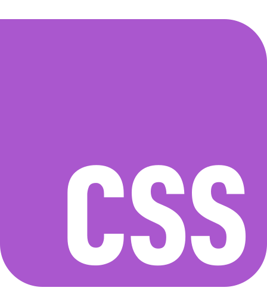
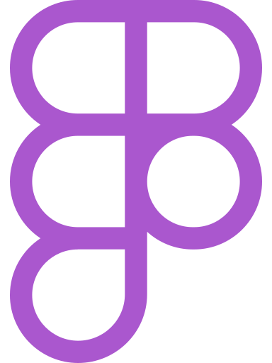
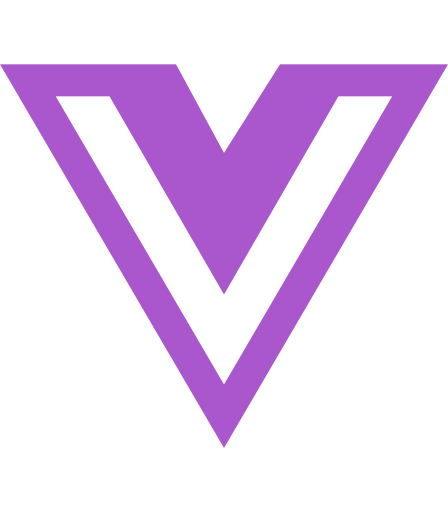

# Hello there 👋

<!--
**Samanta-Petrova/Samanta-Petrova** is a ✨ _special_ ✨ repository because its `README.md` (this file) appears on your GitHub profile.

Here are some ideas to get you started:
-->
## My name is Samanta 
 I’m currently studying web development 
### You can find me here:

## What I can

 
 

 

 

 

 

